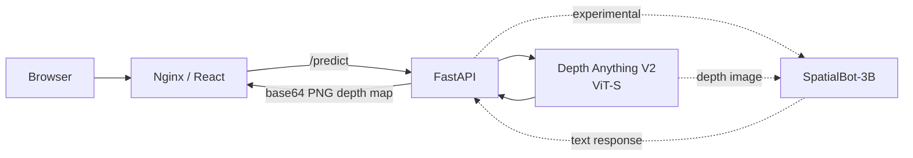

# Depth Estimation App

A containerized computer-vision application for monocular depth estimation, built around **Depth Anything V2** with a **FastAPI** backend and **React/Nginx** frontend.

The project is primarily a public engineering artifact: model integration, API serving, containerization, benchmarking, and a small experimental multimodal extension live in one repository.

## What this project demonstrates

- wrapping a PyTorch vision model behind an HTTP API
- image upload validation and inference handling with FastAPI
- containerized backend/frontend deployment with Docker
- runtime model-weight management rather than baking weights into the image
- benchmarking model variants across latency, throughput, and system-resource usage
- integrating model output into a browser-facing application
- experimenting with RGB + predicted-depth inputs for a vision-language model

## Architecture



The default depth path uses a **Depth Anything V2 ViT-S** model. The backend loads the model once at startup and runs inference under `torch.no_grad()`.

## Repository structure

```text
.
├── notebooks/                  # model experiments and benchmarking
├── src/
│   ├── backend/                # FastAPI API and model adapters
│   ├── depth_estimation/       # Depth Anything wrapper and CV utilities
│   └── frontend/               # React application served by Nginx
├── docker-compose.yml
├── entrypoint.sh               # runtime model-weight bootstrap
├── pyproject.toml
└── README.md
```

## API

### `POST /predict`

Accepts an uploaded image, runs depth estimation, and returns the generated depth map as a base64-encoded PNG.

Supported input MIME types include JPEG, PNG, GIF, BMP, TIFF, and WebP.

### `POST /depthgpt` — experimental

Combines the original RGB image with the generated depth map and passes both to a vision-language model together with a text prompt.

This path is exploratory rather than the core application flow.

## Benchmarking

The repository includes notebooks for comparing Depth Anything model variants and tracking both inference performance and machine utilization.

The benchmark tooling records:

- mean and percentile latency
- throughput
- CPU utilization
- RAM utilization
- GPU utilization
- GPU-memory utilization

Warm-up runs and repeated inference are used so the comparison is not based on a single timing sample.

See:

- `notebooks/2024-11-16-depth-anything-launch-and-benchmark.ipynb`
- `notebooks/2024-11-23-benchmark-depth-anything-models.ipynb`

## Running locally

### Prerequisites

- Docker
- NVIDIA Container Toolkit for the CUDA backend image
- Git

The backend image is based on the PyTorch CUDA runtime.

### Build and run

```bash
git clone https://github.com/trybushenko/Depth-Estimation-App.git
cd Depth-Estimation-App

docker compose up --build
```

Then open:

- frontend: `http://localhost:8080`
- FastAPI docs: `http://localhost:8000/docs`

The backend entrypoint downloads the configured Depth Anything weights at runtime into `tmp/model-weights/` if they are not already present.

## Container design

The frontend uses a multi-stage Docker build:

1. Node builds the React application.
2. Nginx serves the compiled static assets.
3. Nginx proxies `/predict` requests to the backend service.

The backend image:

- starts from a PyTorch CUDA runtime
- installs Python dependencies through Poetry
- copies only the backend and depth-estimation source required at runtime
- downloads model weights when the container starts
- launches Uvicorn on port 8000

A `.dockerignore` keeps notebooks, local caches, frontend files, and development artifacts out of the backend build context.

## Current limitations

This repository is a portfolio/research prototype rather than a production service.

- The experimental LVLM component is imported by the current backend and can require additional model access and substantial GPU memory.
- Automated API/model tests and CI are not yet part of this repository.
- Benchmark notebooks provide the measurement harness, but there is not yet a versioned benchmark report committed as a release artifact.

Those gaps are intentionally not hidden here: the project is useful as evidence of practical CV integration and serving work, while newer repositories focus more explicitly on release engineering, reproducibility, CI, and production-readiness.

## Stack

**ML/CV:** PyTorch, Depth Anything V2, OpenCV, NumPy  
**Backend:** FastAPI, Uvicorn, Pillow  
**Frontend:** React, TypeScript, Nginx  
**Infrastructure:** Docker, Docker Compose, Poetry  
**Benchmarking:** psutil, GPUtil, Pandas, Matplotlib
